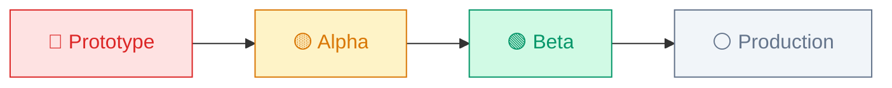

# 🏛️ EA QUALITY ASSESSMENT — Smart-Money-Web

> **Reviewer**: Enterprise Architect (Claude Opus 4.6 Thinking)  
> **Date**: 14/05/2026  
> **Method**: Full source code audit — 14 source files, ~5,400 LOC, 410KB total  
> **Scope**: Architecture, Code Quality, Security, Scalability, Production Readiness

---

## EXECUTIVE SUMMARY

| Dimension | Score | Grade |
|-----------|:-----:|:-----:|
| **Architecture & Design** | 7.0/10 | B |
| **Code Quality & Maintainability** | 5.5/10 | C+ |
| **Data Layer & Persistence** | 4.5/10 | D+ |
| **Security & Auth** | 3.0/10 | F |
| **UI/UX Design** | 9.0/10 | A |
| **DevOps & Deployment** | 3.5/10 | D |
| **Testing & Quality Assurance** | 1.0/10 | F |
| **Documentation Governance** | 3.0/10 | F |
| **OVERALL** | **4.6/10** | **D+** |

> [!IMPORTANT]
> Smart-Money-Web has **exceptional UI/UX** and **clever architectural ideas** (DataAdapter dual-mode, Tweaks Panel), but is **NOT production-ready**. Critical gaps in security, testing, and data consistency must be resolved before any deployment beyond demo/prototype.

---

## 1. ARCHITECTURE & DESIGN — 7.0/10 (B)

### 1.1 Strengths

**DataAdapter Pattern (Excellent)**
- [sm-data-adapter.js](file:///d:/UNG%20DUNG%20AI/TOOL%20AI%202026/CVF-Workspace/Smart-Money-Web/sm-data-adapter.js) implements a clean Adapter/Strategy pattern
- Unified API surface for 13 entity domains (Auth, Categories, Members, Transactions, Budgets, Recurring, Funds, Settings, AuditLog, Reports)
- Runtime mode switching: `isSupabaseMode()` → Supabase or MOCK_DATA
- ~446 lines, well-organized with clear section comments

**Component Architecture**
```
Smart Money.html (entry) → Babel transpile → React 18
  └─ sm-app.jsx (Root + Router)
       └─ sm-layout.jsx (Shell: Sidebar + Header + Context)
            ├─ sm-dashboard.jsx (Dashboard + Charts)
            ├─ sm-transactions.jsx (Full CRUD ✅)
            ├─ sm-pages.jsx (Members/Reports/Categories/Budgets/Recurring/Funds/Settings)
            ├─ sm-personal.jsx (Personal Finance)
            ├─ sm-personal-settings.jsx (Personal Settings)
            └─ sm-approval.jsx (Approvals + Audit Log)
```

**Two-zone Navigation** — Clean separation of "Quỹ tập thể" vs "Cá nhân" domains in sidebar

### 1.2 Architectural Risks

> [!WARNING]
> **CDN React + Babel Standalone = Non-Production Architecture**
> - All `.jsx` files loaded via `<script type="text/babel">` and transpiled in-browser
> - No tree-shaking, no code splitting, no minification
> - ~333-line HTML entry with all CSS inlined (18.5KB)
> - Babel Standalone adds ~2MB to page load
> - No module system — all exports via `window.X = X` pattern

| Risk | Severity | Impact |
|------|:--------:|--------|
| In-browser Babel transpilation | 🔴 HIGH | ~3s load penalty, no caching, no source maps in prod |
| All state in React memory | 🔴 HIGH | Page refresh = total data loss (Mock mode) |
| No routing — `setPage()` state only | 🟡 MED | No bookmarks, no browser back, no deep links |
| Single HTML file entry | 🟡 MED | Cannot do code splitting or lazy loading |
| No Error Boundary | 🟡 MED | One component crash = white screen |
| Global `window.*` exports | 🟡 MED | Namespace pollution, no encapsulation |

### 1.3 File Size Distribution

| File | Lines | KB | Role |
|------|------:|---:|------|
| sm-pages.jsx | 1,422 | 70.8 | **⚠ God file** — 7 pages in 1 file |
| sm-personal.jsx | ~1,100 | 55.6 | Personal finance (3 sub-pages) |
| sm-dashboard.jsx | 406 | 22.3 | Dashboard + PersonalWidget |
| sm-transactions.jsx | 408 | 21.4 | Transactions CRUD ✅ Best pattern |
| sm-supabase.js | 747 | 19.9 | Supabase service (40+ functions) |
| sm-data.js | ~600 | 18.7 | MOCK_DATA definition |
| sm-approval.jsx | 359 | 17.7 | Approvals + AuditLog |
| sm-personal-settings.jsx | 308 | 17.0 | Personal settings |
| sm-import-export.js | 452 | 15.4 | Import/Export service |
| sm-data-adapter.js | 446 | 14.3 | DataAdapter ✅ |
| sm-layout.jsx | 270 | 11.9 | App shell |
| sm-app.jsx | 186 | 9.1 | Root component |
| sm-icons.jsx | ~250 | 8.4 | SVG icon library |

> [!WARNING]
> `sm-pages.jsx` at **1,422 lines** is a maintenance hazard. Should be split into 7 separate component files.

---

## 2. CODE QUALITY & MAINTAINABILITY — 5.5/10 (C+)

### 2.1 MOCK_DATA Coupling Audit

This is the **single biggest code quality issue**. MOCK_DATA references remain scattered across the codebase:

| File | MOCK_DATA Refs | Status | Severity |
|------|:--------------:|:------:|:--------:|
| sm-data-adapter.js | 30+ | ✅ Expected — adapter layer | OK |
| sm-data.js | Definition | ✅ Expected — data source | OK |
| sm-import-export.js | 10+ | ✅ Correct — restore to MOCK | OK |
| sm-personal.jsx | ~22 | 🔴 **Not migrated** | HIGH |
| sm-personal-settings.jsx | ~12 | 🔴 **Not migrated** | HIGH |
| sm-layout.jsx | 7 | 🔴 **User + badges from MOCK** | HIGH |
| sm-dashboard.jsx | 3 | 🟡 PersonalWidget + fallback | MED |
| sm-approval.jsx | 6 | 🔴 **Always fallback MOCK** | HIGH |
| sm-pages.jsx | 8 | 🟡 exportPDF + Settings user | MED |

**Total non-adapter MOCK_DATA refs in UI components: ~58**

### 2.2 Pattern Consistency

**✅ Gold Standard** — `sm-transactions.jsx`:
- `useEffect` → `DataAdapter.getX()` → `useState`
- Loading state, error handling, try/catch
- CRUD operations via DataAdapter
- No direct MOCK_DATA references

**❌ Anti-Pattern** — `sm-personal-settings.jsx`:
```javascript
// Line 70: Direct MOCK_DATA mutation
const groups = MOCK_DATA.personalCategoryGroups;
const [salary, setSalary] = useState(MOCK_DATA.salaryInfo.monthlySalary);
```

**❌ Anti-Pattern** — `sm-layout.jsx`:
```javascript
// Line 105: Sidebar reads MOCK_DATA directly — no DataAdapter
const user = MOCK_DATA.user;
const pendingCounts = {
  approvals: (MOCK_DATA.approvalRequests || []).filter(...)
};
```

### 2.3 Code Smells

| Smell | Location | Impact |
|-------|----------|--------|
| God file (1,422 lines) | sm-pages.jsx | Hard to maintain |
| Hardcoded year `2026` | Dashboard L223, L255; Pages L235, L377 | Will break in 2027 |
| Hardcoded month `2026-05` | Dashboard L103, L255 | Only shows May data |
| `alert()` for user feedback | 12 occurrences across app | Poor UX |
| `confirm()` for destructive actions | Members, Categories, Budgets | Poor UX |
| Inline styles everywhere | All components | No style reuse, hard to theme |
| No prop-types or TypeScript | All components | No compile-time safety |

---

## 3. DATA LAYER & PERSISTENCE — 4.5/10 (D+)

### 3.1 Supabase Service (Well-Built)

[sm-supabase.js](file:///d:/UNG%20DUNG%20AI/TOOL%20AI%202026/CVF-Workspace/Smart-Money-Web/sm-supabase.js) — 747 lines, comprehensive:
- ✅ Full CRUD for 7 entities (Categories, Members, Transactions, Funds, Budgets, Recurring, Settings)
- ✅ Audit logging on every write operation (`logAudit()`)
- ✅ Auth integration (signIn, signOut, getSession, Google OAuth)
- ✅ `organization_id` scoping on all queries
- ✅ Seed function from MOCK_DATA
- ✅ Recurring transaction processing engine

### 3.2 Schema Quality (Good)

[schema.sql](file:///d:/UNG%20DUNG%20AI/TOOL%20AI%202026/CVF-Workspace/Smart-Money-Web/supabase/schema.sql) — 290 lines:
- ✅ UUID primary keys, proper FK constraints
- ✅ CHECK constraints on enums and ranges
- ✅ Performance indexes on 6 transaction columns
- ✅ RLS enabled on all 9 tables
- ✅ Role-based write policies (admin/treasurer only)
- ✅ 3 useful views (monthly summary, member payments, fund balances)
- ✅ Auto-create profile trigger

> [!CAUTION]
> **Missing tables for Personal Finance domain:**
> - No `personal_wallets` table
> - No `personal_transactions` table
> - No `personal_budgets` / `personal_categories` tables
> - No `approval_requests` table
> 
> These 4 missing tables mean the entire Personal Finance module and Approval workflow operate 100% on in-memory MOCK_DATA.

### 3.3 Migration Completeness

| Component | DataAdapter | Supabase | Migration Status |
|-----------|:-----------:|:--------:|:----------------:|
| Transactions | ✅ | ✅ | ✅ **Complete** |
| Categories | ✅ | ✅ | ✅ Complete |
| Members | ✅ | ✅ | ✅ Complete |
| Budgets | ✅ | ✅ | ✅ Complete |
| Recurring | ✅ | ✅ | ✅ Complete |
| Funds | ✅ | ✅ | ✅ Complete |
| Reports | ✅ | ✅ | ✅ Complete |
| AuditLog | ✅ | ✅ | ⚠ Partial (fallback) |
| Approvals | ❌ | ❌ | 🔴 **Not started** |
| Personal Wallets | ❌ | ❌ | 🔴 **Not started** |
| Personal Spend | ❌ | ❌ | 🔴 **Not started** |
| Personal Settings | ❌ | ❌ | 🔴 **Not started** |
| User/Auth | ⚠ | ✅ | ⚠ Mock login only |

**Migration progress: 7/13 domains complete (54%)**

---

## 4. SECURITY — 3.0/10 (F)

> [!CAUTION]
> **Security is the weakest dimension. The app has NO real authentication.**

| Issue | Severity | Detail |
|-------|:--------:|--------|
| **Fake login** | 🔴 CRITICAL | `setTimeout(() => onLogin(), 900)` — no actual auth check |
| **No session validation** | 🔴 CRITICAL | Refreshing page logs user out (state-only) |
| **Supabase keys in source** | 🔴 HIGH | `supabase-config.js` committed (though gitignored) |
| **No CSRF protection** | 🟡 MED | CDN-based app has no CSRF tokens |
| **No input sanitization** | 🟡 MED | User inputs rendered directly in PDF via string interpolation |
| **XSS in exportPDF** | 🟡 MED | `w.document.write()` with unsanitized user data |
| **No rate limiting** | 🟡 MED | No request throttling on Supabase calls |
| **RLS policies good** | ✅ | Schema has proper RLS — but only works if auth is real |

### exportPDF XSS Vector
```javascript
// sm-pages.jsx L256-257 — user-controlled data in document.write()
const fundName = MOCK_DATA.fundAccount?.name || 'Quỹ chính';
const userName = MOCK_DATA.user?.name || 'Thủ quỹ';
// These are injected into raw HTML via template literals
```

---

## 5. UI/UX DESIGN — 9.0/10 (A)

This is where Smart-Money-Web **excels**. The UI quality is enterprise-grade.

### 5.1 Design System (Excellent)

- ✅ CSS custom properties for theming (30+ tokens)
- ✅ Complete dark/light mode via `[data-theme="dark"]`
- ✅ Typography: Space Grotesk (headings) + Inter (body)
- ✅ Consistent spacing, radius, shadow tokens
- ✅ Animated modals (`cubic-bezier(.34,1.56,.64,1)`)
- ✅ Custom scrollbar styling
- ✅ Responsive sidebar with 2-zone navigation

### 5.2 Visual Components

| Component | Quality | Notes |
|-----------|:-------:|-------|
| Login screen | ⭐⭐⭐⭐⭐ | Gradient bg, glass card, Google OAuth button |
| Dashboard hero card | ⭐⭐⭐⭐⭐ | Gradient, decorative circles, stat breakdown |
| SVG BarChart | ⭐⭐⭐⭐ | Custom, zero-dependency, responsive |
| SVG SpendDonut | ⭐⭐⭐⭐ | Custom donut with legend |
| PersonalWidget | ⭐⭐⭐⭐⭐ | 3-stat grid + budget bars |
| Sidebar | ⭐⭐⭐⭐⭐ | Two-zone with colored dividers |
| Modals | ⭐⭐⭐⭐ | Smooth animation, consistent layout |
| Tweaks Panel | ⭐⭐⭐⭐ | Color picker, slider, toggle |

### 5.3 UI Gaps

- ❌ No loading spinners (just text "Đang tải...")
- ❌ No toast notifications (uses `alert()`)
- ❌ No skeleton screens
- ❌ No responsive mobile layout (sidebar will overlap)
- ❌ No keyboard navigation / accessibility (a11y)

---

## 6. DEVOPS & DEPLOYMENT — 3.5/10 (D)

| Aspect | Status |
|--------|--------|
| Build system | ❌ None — CDN-only |
| Package manager | ❌ No `package.json` |
| Bundler | ❌ In-browser Babel |
| Minification | ❌ None |
| Source maps | ❌ None |
| CI/CD | ❌ None |
| Environment configs | ⚠ `supabase-config.js` exists |
| `.gitignore` | ✅ Present (257 bytes) |
| Deployment docs | ✅ `DEPLOYMENT.md` (Netlify/Vercel) |

> [!NOTE]
> The CDN approach is intentional for prototyping speed. Migration to Vite is documented in ROADMAP as Phase 3.

---

## 7. TESTING — 1.0/10 (F)

| Test Type | Status |
|-----------|--------|
| Unit tests | ❌ None |
| Integration tests | ❌ None |
| E2E tests | ❌ None |
| Manual test plan | ⚠ Referenced in TESTING_GUIDE.md (file doesn't exist) |
| Error boundary | ❌ None |
| Console smoke tests | ⚠ Documented but not automated |

---

## 8. DOCUMENTATION GOVERNANCE — 3.0/10 (F)

The previous QUALITY_REVIEW.md identified that 16 redundant markdown files exist. Current state:

**Kept (5 files — reasonable):**
- README.md, ASSESSMENT.md, ROADMAP.md, QUALITY_REVIEW.md, DEPLOYMENT.md

**Problem:** README.md references files that may not exist (`SUPABASE_SETUP.md`, `TESTING_GUIDE.md`, `PHASE1_PROGRESS.md`, `PHASE1_SUMMARY.md`). The README has stale progress information (says "Phase 1: 50% complete" but actual migration is 54% of 13 domains).

---

## 9. EA RECOMMENDATIONS

### 🔴 P0 — Must Fix Before Any Deployment

1. **Implement Real Authentication** — Connect `LoginScreen` to `SupabaseService.signIn()` or add session persistence via localStorage
2. **Fix XSS in exportPDF** — Sanitize all user inputs before `document.write()`
3. **Add Error Boundary** — Wrap `<PageContent>` in React Error Boundary
4. **Eliminate hardcoded dates** — Replace `2026-05`, `2026` with `new Date()` calculations

### 🟡 P1 — Should Fix Before Beta

5. **Migrate sm-layout.jsx** — Replace 7 MOCK_DATA refs with `DataAdapter.getCurrentUser()` and query-based badge counts
6. **Migrate sm-approval.jsx** — Create `approval_requests` table + DataAdapter methods
7. **Split sm-pages.jsx** — Extract 7 page components into separate files
8. **Add toast notification system** — Replace all `alert()` / `confirm()` calls
9. **Add personal finance Supabase tables** — Schema extension for wallets, personal transactions, budgets

### 🟢 P2 — Should Fix Before Production

10. **Migrate to Vite** — Eliminate in-browser Babel, add tree-shaking, code splitting
11. **Add TypeScript** — Type safety for 5,400 LOC codebase
12. **URL routing** — Hash router for bookmarkable pages
13. **Add automated tests** — At minimum: DataAdapter unit tests + E2E smoke tests
14. **Mobile responsive** — Sidebar collapse, touch-friendly interactions
15. **Accessibility audit** — ARIA labels, keyboard navigation, focus management

---

## 10. MATURITY ASSESSMENT



**Current Position: Late Prototype → Early Alpha**

| To reach Alpha | To reach Beta | To reach Production |
|----------------|---------------|---------------------|
| Real auth | Vite migration | Automated tests |
| Error Boundary | TypeScript | CI/CD pipeline |
| Fix XSS | URL routing | Performance audit |
| Migrate layout MOCK | Mobile responsive | i18n implementation |
| Fix hardcoded dates | Toast notifications | Accessibility (a11y) |

---

## CONCLUSION

Smart-Money-Web is a **visually exceptional prototype** with a **well-designed data abstraction layer** (DataAdapter + Supabase Service). The UI/UX quality is genuinely enterprise-grade and surpasses many production applications.

However, from an EA perspective, the application carries **significant technical debt** in security (fake auth, XSS), maintainability (58 stray MOCK_DATA refs, 1,422-line god file), and operational readiness (zero tests, no build system, no CI/CD).

**Verdict**: The architecture is sound, the UI investment is valuable, and the Supabase service layer is comprehensive. With focused remediation of P0/P1 items (~2-3 sprint efforts), this can reach Beta quality. The foundation is worth building upon.

---

*Assessment conducted by reading 100% of source code across all 14 application files + schema + documentation.*
